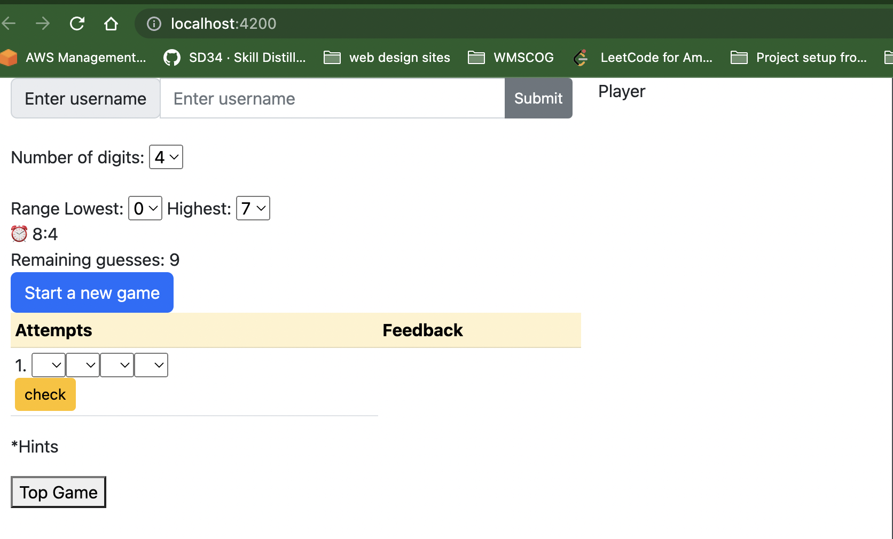

# MindGame
##Overview
Backend: Java Spring Boot and exposed REST Api
FE and BE communicate through REST Api
There are four Apis:
1. Api for starting a new game
2. Api for checking the guessing attempt from player
3. Api for showing hints for each game
4. Api for showing a leader board

attached sequence diagram to show application flow

list of classes and high level of its purpose to show code structure
Controller
MainApp
Game: object to manage games of players
GameDTO: object to return to front end, so random number and hints not being exposed when it is not necessary
Attempt: tracking each guess attempt by the player
Feedback: store feedback for each attempt, storing number of correct numbers and number of correct positions
GameCreateRequestDTO: store require information to start a new game
Hint: object to store hints for each game