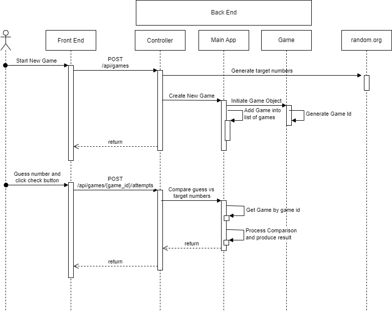

# MindGame

## Overview
This is a number guessing game. This application will generate 4 random numbers between 0 and 7. The user is to guess each of the generated number within 10 attempts. The numbers can be repeated within the sequence of 4. The user is notified within 10 attempts whether or not they guessed the sequence of numbers correctly.
## How to run
The game runs on AWS at URL: 8080
The game will ask for how many numbers to guess, as well as the lowest and highest in the randomly generated numbers.
You will have 10 tries/attempts to guess the right numbers and their correct positions within a 10 minutes time period.
 

#### Sample play:

## Technologies Used
<ul>
<li>Bootstrap</li>
<li>GitHub</li>
<li>Maven</li>
<li>Java</li>
<li>Angular</li>
<li>Javascript</li>
<li>Postman</li>
<li>RESTful Services</li>
<li>SpringToolSuite4</li>
<li>Spring Boot</li>
<li>JSON</li>
</ul>

## Endpoints:
<table>
<thead>
<tr>
<th align="center">HTTP Verb</th>
<th align="left">URI</th>
<th align="center">Request Body</th>
<th align="left">Response Body</th>
<th align="left">Functionality</th>
</tr>
</thead>
<tbody>
<tr>
<td align="center">POST</td>
<td align="left">'/api/games'</td>
<td align="center">JSON</td>
<td align="left">Create a new game</td>
<td align="left">Retrieve random number from external API and create a game Id</td>
</tr>
<tr>
<td align="center">POST</td>
<td align="left">'/api/games/{gameId}/attempts'</td>
<td align="center">JSON</td>
<td align="left">Single Attempt and some properties have values being added</td>
<td align="left">Compare the player guess vs the target and provide corresponding feedback</td>
</tr>
<tr>
<td align="center">GET</td>
<td align="left">'/api/games/{gameId}/hints'</td>
<td align="center"></td>
<td align="left">List of hints</td>
<td align="left">Return a list of hints for given game Id</td>
</tr>
</tbody>
</table>

## High level of sequence diagram

### Classes used
- Controller: handles requests from front end client
- MainApp: game logic
- Game: object to manage games of players
- GameDTO: object to return to front end, so random number and hints not being exposed when it is not necessary
- Attempt: tracking each guess attempt by the player
- Feedback: store feedback for each attempt, storing number of correct numbers and number of correct positions
- GameCreateRequestDTO: store require information to start a new game
- Hint: object to store hints for each game

### Extensions
- There is option for users to choose the number of random numbers: 4, 6, or 8
- Range of random number generated can be more or less than 8 numbers: 0 -> 9 instead of from 0->7 as original
- There is a countdown timer for each game
- Hints can be shown when needed